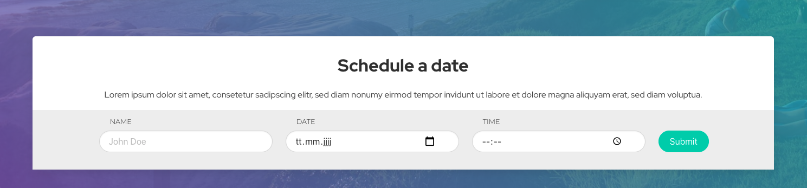

# React Forms Boilerplate
This is boilerplate code I use to build & handle forms in React. Instead of trying to build the 💍ne abstraction to rule them all, I use it as a starting point that can handle 95% of my typical use cases out of the box and adjust or extend it according to what the app needs.

It is structured to be easily adjustable, with all the elements that vary from app to app (but not within an app) in the shared.js file. (HTML-wrappers for fields according to Bootstrap, Tailwind CSS, Status-classNames etc.). 

Form and Fields are composable, just like if you would build form HTML and you can easily create new Field types.

## The goal...
... is to have a consistent way of creating, handling and styling forms throughout the entire application with no effort, especially for applications with tons of forms.

It is basically <a href="https://formik.org/docs/api/formik" target="_blank">Formik</a> & <a href="https://github.com/jquense/yup" target="_blank">Yup</a> in a wrapper to create consistent HTML around fields plus some additional features I often use (loading state handling, toggling disabled state etc.). The config object contains settings for Formik & Yup in a single object, so it is easier to manage. Of course this is highly opinionated, but that´s what makes it easy to use. 


### It does the following things:

- all basic form field types are included
- manages the inner state of the form
- accepts a config object for easy validation settings and initialValues
- can be set disabled (e.g. to toggle between "display mode" and "edit mode" of a form)
- can be set to loading state (in case the inital values are retrieved through an async API call)
- ensures the correct HTML wrappers around the fields
- is composable
- accepts a submit handler


Under the hood it uses <a href="https://formik.org/docs/api/formik" target="_blank">Formik</a> to manage the form state & <a href="https://github.com/jquense/yup" target="_blank">Yup</a> for the validation, but in most cases you can forget that.

If you need some fancier validation logic that is difficult to build with the settings-object, you can provide a yup property and it will override the validations array. ([See here](#fieldSettings))


## Here is a simple example:

```js
const fieldSettings = {
  name: {
    initialValue: '',
    validations: [
      { 
        type: 'min', 
        args: [2, 'Sorry, your name is too short.'] 
      },
      { 
        type: 'max', 
        args: [50, 'Sorry, your name is too long.'] 
      },
    ],
    validationType: 'string',
    required: true,
  },
};

function MyCustomForm(props) {
  const { disabled = false } = props;

  return (
    <Form
      enableReinitialize
      fields={fieldSettings}
      disabled={disabled}
      onSubmit={async (values, actions) => {
        // do some submit logic
      }}
    >
      <TextField
        name="name"
        type="text"
        label="Name"
        placeholder="John Doe"
      />

      <SubmitButton>Submit</SubmitButton>
    </Form>
  );
}
 
```


## Initial Setup
1) Copy src/components/form to your projects components
2) Open shared.js and change what you need to match the HTML structure and CSS class names for your CSS to work


### <FieldWrapper \/> 
The Fieldwrapper Component wraps each Field. Adjust to whatever HTML structure you need according to your CSS or CSS-Framework. The default uses the <a href="https://bulma.io/" target="_blank">Bulma.io</a> structure and classes.

By default it uses Material UI icons. Just remove or replace them if you like.


### Status CSS classes
If necessary change these classes according to what you need and place them where you need. That might depend on you how your CSS works.

```js
export const inputErrorClass = 'is-danger';
export const helpMessageClass = 'help';
```

### <LoadingIndicator \>
The LoadingIndicator is rendered if isLoading is set to true. Just change the return to whatever you wish to look at while the form is in loading state. ⏳

## <Form \/>

### enableReinitialize: Boolean
Set to true if the initialValues change (e.g. from initially an empty string to the value of an async API call)


### <a name="fieldSettings"></a>fields: Object
The field settings object is a combination of Formik settings like initialValue and yup settings like validations in a single object.

- [fieldName]
  - initialValue
  - validations: Array of validation objects ({type: 'yup-function-name', args: ['additional args', 'for yup']})
  - validationType: string|mixed|number|booleam|date|array|object
  - required: Boolean

```js
const fieldSettings = {
  name: {
    initialValue: '',
    validations: [
      { type: 'min', args: [2] },
      { type: 'max', args: [50] },
    ],
    yup: yup.string().required(), // optional: overrides validations
    validationType: 'string',
    required: true,
  },
}
```

The different validation methods can be found <a href="https://github.com/jquense/yup#api" target="_blank">here</a>. A validation object has 2 properties. **type** is the name of the yup validation method and **args** is an array of optional arguments passed to the validation method.

- The validation methods are called in the order of the array
- **required** is a separate property
- **validationType** is optional and defaults to string

If you check the Yup documentation, this...

```js
{
  email: yup.string().required().email('e.g. 🤬 A custom error message')
}
```
... translates to:

```js
{
  email: {
    initialValue: 'test@gmail.com',
    validations: [
      {
        type: 'email', // yup function name
        args: ['e.g. 🤬 A custom error message'] 
        // optional arguments according to yup documentation
      }
    ],
    validationType: 'string', // initial validationType
    required: true // required is separate
  }
}

```

And if you find it useful to create the Yup object yourself, just add a **yup** property, but don´t forget to import yup.

```js
import * as yup from 'yup';


{
  email: {
    initialValue: 'test@gmail.com',
    yup: yup.string().required().email('e.g. 🤬 A custom error message')
  }
}

```

### disabled: Boolean && isLoading: Boolean 
disabled: Optional (default false). Sets form disabled.

isLoading: Optional (default false). Sets the form disabled & displays a <LoadingIndicator \> Component. The LoadingIndicator can be changed in (shared.js)

The form will be disabled if one of them is true.

### onSubmit: function
Your submit handler. Receives (values, actions). See <a href="https://formik.org/docs/api/form" target="_blank">Formik documentation</a>.


## Field Components

### TextField
```js
<TextField
  name="your-field-name"
  // has to match fieldSettings property name
  type="text|email|tel|date ..."
  label="Your Label"
  placeholder="Your Placeholder"
/>
```

### SelectField

```js
<SelectField
   name="your-field-name"
   // has to match fieldSettings property name
  options={[
    {
      value: "value-1",
      label: "Value 1",
    },
    {
      value: "value-2",
      label: "Value 2",
    },
  ]}
  label="Your Label"
   placeholder="Please Select something..."
/>
```


### Textarea
```js
<Textarea
  name="your-field-name"
  // has to match fieldSettings property name
  type="text|email|tel|date ..."
  label="Your Label"
  placeholder="Your Placeholder"
/>
```


### CheckBox
```js
<CheckBox 
name="accept-something"
// has to match fieldSettings property name
>
  I accept some shady stuff. For more info click
  <a href="https://xyz.org" target="_blank" rel="noreferrer"> here</a>.
</CheckBox>
```

### RadioGroup

```js
<RadioGroup
  name="likeMusic"
  // has to match fieldSettings property name
  options={[{ value: true, label: "Yes" }, { value: false, label: "No }]}
  label="Do you like good music?"
/>
```

### SubmitButton
```js
 <SubmitButton>Save</SubmitButton>
```

### YourCustomField

If you need additional Field types, just use this as a boilerplate, do what you like and export it from index.js.

```js
import React from 'react';
import { Field as FormikField, useFormikContext } from 'formik';
import { FieldWrapper, inputErrorClass } from './shared';

export default function YourCustomField(props) {

  const { name, label, placeholder, ...rest } = props;
  const { errors, touched, isSubmitting } = useFormikContext();

  return (
    <FieldWrapper {...props} fieldType="textfield">
      <FormikField
        {...rest}
        id={name}
        name={name}
        disabled={isSubmitting}
        placeholder={placeholder || ''}
        className={`input is-rounded ${
          errors[name] && touched[name] ? inputErrorClass : ''
        } has-icons-right`}
      />
    </FieldWrapper>
  );
}
```